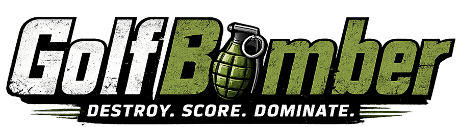
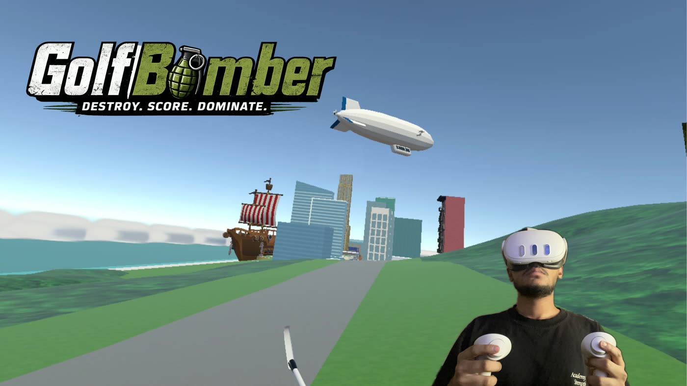

<p align="center">
  
</p>

A VR game where you start on a boat off the coast of a city, tee up grenade-style bomb balls, and drive them into skyscrapers to score points. Built for Meta Quest 3.



## Tech Stack

- **Engine:** Unity 6.3 LTS (`6000.3.15f1`)
- **VR:** OpenXR + XR Interaction Toolkit 3.3.1
- **Target:** Meta Quest 3 (standalone Android build)
- **Dev platform:** macOS (Apple Silicon)

## Getting Started

1. Install **Unity Hub** and add **Unity Editor 6000.3.15f1** with the **Android Build Support** module.
2. Clone this repo.
3. Open Unity Hub → **Add → Add project from disk** → select the cloned folder.
4. Open in Unity. First launch takes 5–15 min while it regenerates `Library/`.
5. Open `Assets/Scenes/MainMenu.unity` to start, or jump directly to `Assets/Scenes/Main.unity` to play.

### Building for Quest 3

1. **File → Build Profiles** → Android platform → Switch platform.
2. Connect Quest 3 via USB, enable developer mode.
3. **Build And Run.**

## Controls

| Action | Button |
|---|---|
| Tee up bomb ball | Auto-spawns on the spawn indicator in front of you |
| Hit bomb | Swing right controller (golf club) into ball |
| Enter / exit car | Press **X** (left controller) when near car |
| Drive forward | Right trigger |
| Steer car | Left joystick (left/right) |
| Main menu interactions | Right controller ray + trigger |

## Folder Layout

```
Assets/
├── Audio/                 # Destruction SFX
├── BuildingTypeSOs/       # ScriptableObject configs per building (points, sound)
├── Materials/
├── Models/
│   ├── city/              # Skyscrapers, towers, fog borders
│   ├── ships/             # Boat
│   └── tools/             # Golf club, bomb ball, car
├── Prefabs/
├── Scenes/
│   ├── MainMenu.unity
│   └── Main.unity
├── Scripts/
│   ├── Gameplay/          # BombBall, CarController, DestructibleBuilding, ...
│   ├── Systems/           # ScoreManager, DestructionTracker (singletons + events)
│   ├── UI/                # ScoreUI, DestructionLogUI, FollowRigSide, SceneLoader
│   └── Util/              # SupportChecker
└── XR/                    # OpenXR settings
```

## Architecture Notes

- **`BuildingType` (ScriptableObject)** holds per-building data: display name, points, destroy sound. Each `DestructibleBuilding` references one — no inline configs.
- **`ScoreManager` / `DestructionTracker`** are singleton MonoBehaviours with `event Action`-based pub/sub. UI subscribes; gameplay publishes.
- **Cascade physics:** when a building is destroyed it fires `OnAnyBuildingDestroyed`. Neighbours raycast downward (5-point support check) and fall if no support.
- **CarController** is a kinematic Rigidbody with manual SweepTest collision, slope-walking via `Vector3.ProjectOnPlane`, step-up climb, and surface-normal tilt alignment. The XR rig is force-locked to the driver seat in `LateUpdate` while occupied.
- **VR UI:** body-locked HUD (`FollowRigSide`) for the score panel; head-locked HUD (`FollowHeadHud`) for prompts. Main menu uses World Space Canvas + `TrackedDeviceGraphicRaycaster` + `XRUIInputModule`.

## Status

Active development. Working features:
- [x] Boat → city setup with destructible buildings
- [x] Bomb spawning + golf club hit physics
- [x] Score + destruction log UI
- [x] Driveable car (gravity, hills, slopes)
- [x] Main menu with VR ray pointer

Planned:
- [ ] Floor-by-floor tower spawner (script done, scene setup deferred)
- [ ] Fog GPU instancing (see [docs/fog-optimization.md](docs/fog-optimization.md))
- [ ] How-To-Play sign in world
